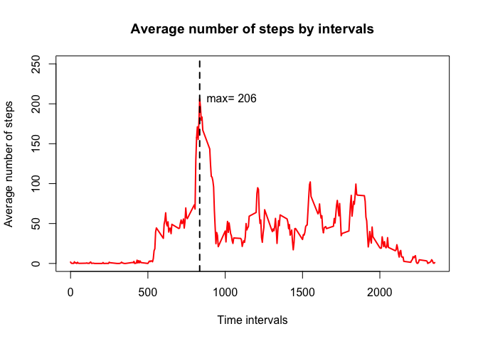
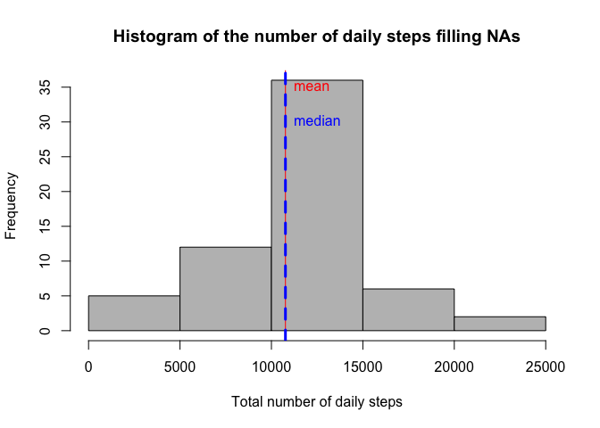
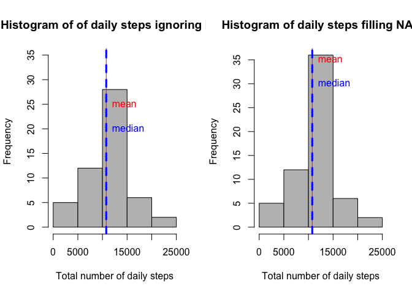
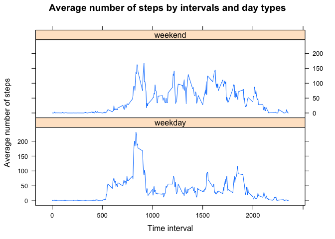

# Reproducible Research: Peer Assessment 1
## Global settings

```r
echo = TRUE  # Always make code visible
options(scipen = 1)  # Turn off scientific notations for numbers
```

## Loading and preprocessing the data

Show any code that is needed to

1. Load the data (i.e. 𝚛𝚎𝚊𝚍.𝚌𝚜𝚟())
2. Process/transform the data (if necessary) into a format suitable for your analysis


```r
#setwd('set the working directory')
unzip('./activity.zip')
data<-read.csv('./activity.csv',header=T)
str(data)
```

```
## 'data.frame':	17568 obs. of  3 variables:
##  $ steps   : int  NA NA NA NA NA NA NA NA NA NA ...
##  $ date    : Factor w/ 61 levels "2012-10-01","2012-10-02",..: 1 1 1 1 1 1 1 1 1 1 ...
##  $ interval: int  0 5 10 15 20 25 30 35 40 45 ...
```


## What is mean total number of steps taken per day?

For this part of the assignment, ignore the missing values in the dataset.

1. Calculate the total number of steps taken per day
2. Make a histogram of the total number of steps taken each day
3. Calculate and report the mean and median of the total number of steps taken per day


```r
#total daily steps 
dailystep<-aggregate(steps~date,data,sum)#by default aggregate() ignores NAs
#make the histogram
hist(dailystep$steps,col='gray',xlab='Total number of daily steps', main='Histogram of the number of daily steps ignoring NAs')
abline(v=mean(dailystep$steps),lty='solid',lwd=1,col='red')
abline(v=median(dailystep$steps),lty='dashed',lwd=3,col='blue')
text(mean(dailystep$steps),25,labels='mean',pos=4,col='red')
text(median(dailystep$steps),20,labels='median',pos=4,col='blue')
```

\

```r
#the mean of the total number of dayily steps 
round(mean(dailystep$steps))
```

```
## [1] 10766
```

```r
#the median of the total number of dayily steps 
round(median(dailystep$steps))
```

```
## [1] 10765
```
So the  mean of the total number of steps taken per day is 10766 and the median is 10765.


## What is the average daily activity pattern?

1. Make a time series plot (i.e. 𝚝𝚢𝚙𝚎 = "𝚕") of the 5-minute interval (x-axis) and the average number of steps taken, averaged across all days (y-axis)
2. Which 5-minute interval, on average across all the days in the dataset, contains the maximum number of steps?


```r
#average steps 
avestep_interval<-aggregate(steps~interval,data,mean)
#plot the average steps v.s. intervals
with(avestep_interval, plot(interval,steps,type='l',col='red', lwd=2, ylim=c(0,250), xlab='Time intervals',
                            ylab='Average number of steps', main='Average number of steps by intervals'))

abline(v=avestep_interval[which.max(avestep_interval$steps),1],col='black',lwd=2,lty='dashed')

text(avestep_interval[which.max(avestep_interval$steps),1],max(avestep_interval$steps), 
     labels=paste('max=',as.character(round(max(avestep_interval$steps)))),pos=4,col='black')
```

\

```r
#which interval on average across all the days contains the maximum number of steps
avestep_interval[which.max(avestep_interval$steps),1]
```

```
## [1] 835
```
As shown in the figure, the interval with the maximum average step is 835 and the number of steps for that interval is 206.

## Imputing missing values

Note that there are a number of days/intervals where there are missing values (coded as 𝙽𝙰). The presence of missing days may introduce bias into some calculations or summaries of the data.

1. Calculate and report the total number of missing values in the dataset (i.e. the total number of rows with 𝙽𝙰s)
2. Devise a strategy for filling in all of the missing values in the dataset. The strategy does not need to be sophisticated. For example, you could use the mean/median for that day, or the mean for that 5-minute interval, etc.
3. Create a new dataset that is equal to the original dataset but with the missing data filled in.
4. Make a histogram of the total number of steps taken each day and Calculate and report the mean and median total number of steps taken per day. Do these values differ from the estimates from the first part of the assignment? What is the impact of imputing missing data on the estimates of the total daily number of steps?


```r
#total number of rows with NAs
data.incomplete<-data[!complete.cases(data),]
nrow(data.incomplete)
```

```
## [1] 2304
```

```r
#Missing values in the dataset are replaced by the mean for that 5-minute interval.
avestep_interval<-aggregate(steps~interval,data,mean)
filldata<-data
for(i in 1:nrow(filldata)){
        if(is.na(filldata$steps[i])){
                filldata$steps[i]<-avestep_interval$steps[
                which(avestep_interval$interval==filldata$interval[i])]                                 }
                     }
str(filldata)
```

```
## 'data.frame':	17568 obs. of  3 variables:
##  $ steps   : num  1.717 0.3396 0.1321 0.1509 0.0755 ...
##  $ date    : Factor w/ 61 levels "2012-10-01","2012-10-02",..: 1 1 1 1 1 1 1 1 1 1 ...
##  $ interval: int  0 5 10 15 20 25 30 35 40 45 ...
```

```r
#make a histogram of the total number of steps taken each day.
dailystep_fillNAs<-aggregate(steps~date,filldata,sum)
hist(dailystep_fillNAs$steps,col='gray',xlab='Total number of daily steps', main='Histogram of the number of daily steps filling NAs')
abline(v=mean(dailystep_fillNAs$steps),lty='solid',lwd=1,col='red')
abline(v=median(dailystep_fillNAs$steps),lty='dashed',lwd=3,col='blue')
text(mean(dailystep_fillNAs$steps),35,labels='mean',pos=4,col='red')
text(median(dailystep_fillNAs$steps),30,labels='median',pos=4,col='blue')
```

\

```r
#the mean of the total number of dayily steps 
round(mean(dailystep_fillNAs$steps))
```

```
## [1] 10766
```

```r
#the median of the total number of dayily steps 
round(median(dailystep_fillNAs$steps))
```

```
## [1] 10766
```

The mean and median of total number of steps taken per day are the same, namely 10766.

###compare the histograms with and without NAs

```r
par(mfrow=c(1,2))
#ignoring NAs
hist(dailystep$steps,ylim=c(0,35),col='gray',xlab='Total number of daily steps', main='Histogram of of daily steps ignoring NAs')
abline(v=mean(dailystep$steps),lty='solid',lwd=1,col='red')
abline(v=median(dailystep$steps),lty='dashed',lwd=3,col='blue')
text(mean(dailystep$steps),25,labels='mean',pos=4,col='red')
text(median(dailystep$steps),20,labels='median',pos=4,col='blue')
#filling NAs
hist(dailystep_fillNAs$steps,col='gray',xlab='Total number of daily steps', main='Histogram of daily steps filling NAs')
abline(v=mean(dailystep_fillNAs$steps),lty='solid',lwd=1,col='red')
abline(v=median(dailystep_fillNAs$steps),lty='dashed',lwd=3,col='blue')
text(mean(dailystep_fillNAs$steps),35,labels='mean',pos=4,col='red')
text(median(dailystep_fillNAs$steps),30,labels='median',pos=4,col='blue')
```

\

```r
#for the original data
round(quantile(dailystep$steps,c(0.25,0.5,0.75)))
```

```
##   25%   50%   75% 
##  8841 10765 13294
```

```r
#for the new data with NAs filled
round(quantile(dailystep_fillNAs$steps,c(0.25,0.5,0.75)))
```

```
##   25%   50%   75% 
##  9819 10766 12811
```
As shown in the histogram, after filling the NAs in the 'steps' column in the original data set by its corresponding mean in that interval the mean stays the same. However the frequency in the histogram changes a little, indicating that the quantiles are changed by filling the NAs. While the original quantiles (1st, median, and 3rd quantiles) for the 'steps' are
8841, 10765, 13294,  they change into 9819, 10766, 12811.

## Are there differences in activity patterns between weekdays and weekends?

For this part the 𝚠𝚎𝚎𝚔𝚍𝚊𝚢𝚜() function may be of some help here. Use the dataset with the filled-in missing values for this part.

1. Create a new factor variable in the dataset with two levels – “weekday” and “weekend” indicating whether a given date is a weekday or weekend day.
2. Make a panel plot containing a time series plot (i.e. 𝚝𝚢𝚙𝚎 = "𝚕") of the 5-minute interval (x-axis) and the average number of steps taken, averaged across all weekday days or weekend days (y-axis). See the README file in the GitHub repository to see an example of what this plot should look like using simulated data.


```r
#create a new factor variable with two levels – “weekday” and “weekend”.
filldata$day<-as.factor(ifelse(weekdays(as.Date(filldata$date))%in%c('Saturday','Sunday'),'weekend','weekday'))
table(filldata$day)
```

```
## 
## weekday weekend 
##   12960    4608
```

```r
#Make a panel plot of the average steps v.s. intervals averaged across all weekday days or weekend days. 
avestep_intervalday<-aggregate(steps~interval+day,filldata,mean)
library(lattice)
with(avestep_intervalday,xyplot(steps~interval|day,layout=c(1,2),type='l',xlab='Time interval',
       ylab='Average number of steps', main='Average number of steps by intervals and day types'))
```

\


The figure indicates that the subject tends to be active earlier in the weekday than the weekend in the beginning of the day but is more active on weekend for most of the day.
